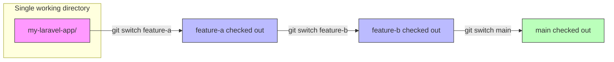
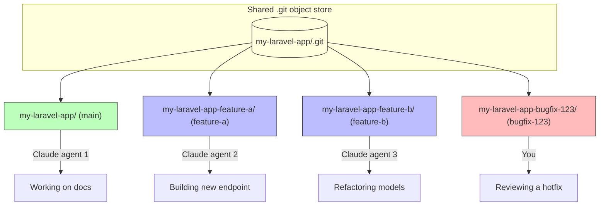

It seems impossible nowadays to go any amount of time without someone mentioning
something about worktrees, especially now in the AI era. None of us are writing code
by hand anymore and it feels shameful to do so (there's a /s in the somewhere). With
every dev now being 1000x and seemingly looking to be replaced by AI in the next six months,
I figured as a last bout of employment in this industry, I would write a bit how I use
worktrees tailored to Laravel development. This isn't a one-size-fits-all solution, nor
is it meant to be.

At work, we use Herd, though as the complexity of your app grows, there can be friction
with Herd. Managing multiple versions of PHP, services attempting to startup and step on
each other's ports, and orphaning linked valet sites can be a real headache at times.
I have a love/slightly annoyed relationship with Herd for this reason. It's mostly self-induced,
though if you're working on a straightforward Laravel app, I'd wager there's really no better
tool for getting up and running quickly with all the things you need to run an actual app
people use (mail, queues, debugging, logging, etc.). You can 100% DIY your own PHP setup
tailored for Laravel, but Herd takes the headache of it away and provides a singe focal point
for getting up and running in record time.

This isn't a Herd ad, I promise. With that premise out of the way, I do more worktree-based
development these days as agentic coding tools make it _too_ easy to develop multiple things
in parallel (that doesn't mean they're tested/good, btw). I've really been enjoying [worktrunk](https://worktrunk.dev/) as my worktree manager, and while it's not absolutely necessary for managing worktrees, you'll
quick find that the built-in worktree tools for git are skibidi ohio (as the kids say).

## Worktrunk and you

With worktrees, your mental model of development with branches shifts a bit:

- `git switch` and `git checkout` become `cd`
- Branches are folders on local disk
- Every repository has at least one worktree - `main`

Worktrees shine in the world of AI dev because we can throw Claude/Codex at a worktree
and have them work independently of other features/branches without stepping on each other's
toes. A diagram, because who doesn't love mermaid:

### Traditional branching workflow

With a typical branch-based workflow, you have a single working directory and switch between branches. Only one branch is "active" at a time:

You're constantly stashing, switching, and context-swapping. If Claude is mid-generation on `feature-a` and you want to check something on `main`... tough luck.

### Worktree workflow

With worktrees, each branch lives in its own directory on disk. They all share a single `.git` object store, so there's no duplication of history:

Every worktree is a fully functional checkout. You can `cd` between them, run `php artisan serve` on different ports, and have multiple agents working simultaneously without conflicts. No stashing, no switching, no waiting.

There's one problem though. If you're using Herd, it means you're using valet under the hood. And our apps
need setup to work correctly. If I were to rip a fresh worktree in a Laravel app, just how in the heck do I
get it prepped to be fully functional?

That's where worktrunk comes in.
