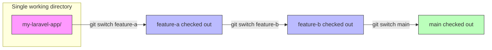
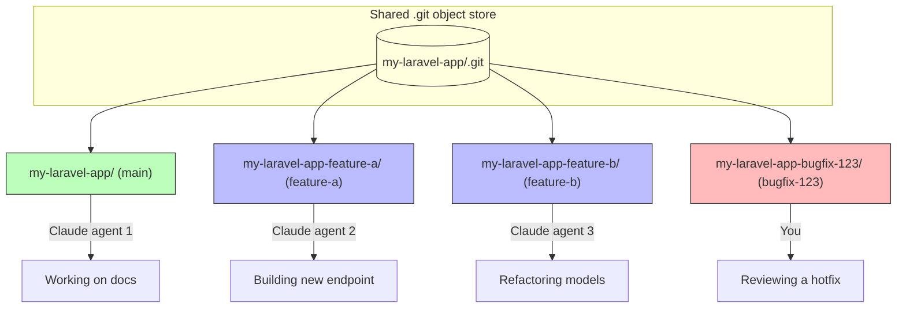

It seems impossible nowadays to go any amount of time without someone mentioning
something about worktrees, especially now in the AI era. None of us are writing code
by hand anymore and it feels shameful to do so (there's a /s in the somewhere). With
every dev now being 1000x and seemingly looking to be replaced by AI in the next six months,
I figured as a last bout of employment in this industry, I would write a bit how I use
worktrees tailored to Laravel development. This isn't a one-size-fits-all solution, nor
is it meant to be.

At work, we use Herd, though as the complexity of your app grows, there can be friction
with Herd. Managing multiple versions of PHP, services attempting to startup and step on
each other's ports, and orphaning linked valet sites can be a real headache at times.
I have a love/slightly annoyed relationship with Herd for this reason. It's mostly self-induced,
though if you're working on a straightforward Laravel app, I'd wager there's really no better
tool for getting up and running quickly with all the things you need to run an actual app
people use (mail, queues, debugging, logging, etc.). You can 100% DIY your own PHP setup
tailored for Laravel, but Herd takes the headache of it away and provides a singe focal point
for getting up and running in record time.

This isn't a Herd ad, I promise. With that premise out of the way, I do more worktree-based
development these days as agentic coding tools make it _too_ easy to develop multiple things
in parallel (that doesn't mean they're tested/good, btw). I've really been enjoying [worktrunk](https://worktrunk.dev/) as my worktree manager, and while it's not absolutely necessary for managing worktrees, you'll
quick find that the built-in worktree tools for git are skibidi ohio (as the kids say).

## Worktrunk and you

With worktrees, your mental model of development with branches shifts a bit:

- `git switch` and `git checkout` become `cd`
- Branches are folders on local disk
- Every repository has at least one worktree - `main`

Worktrees shine in the world of AI dev because we can throw Claude/Codex at a worktree
and have them work independently of other features/branches without stepping on each other's
toes. A diagram, because who doesn't love mermaid:

### Traditional branching workflow

With a typical branch-based workflow, you have a single working directory and switch between branches. Only one branch is "active" at a time:



You're constantly stashing, switching, and context-swapping. If Claude is mid-generation on `feature-a` and you want to check something on `main`... tough luck.

### Worktree workflow

With worktrees, each branch lives in its own directory on disk. They all share a single `.git` object store, so there's no duplication of history:



Every worktree is a fully functional checkout. You can `cd` between them, run `php artisan serve` on different ports, and have multiple agents working simultaneously without conflicts. No stashing, no switching, no waiting.

There's one problem though. If you're using Herd, it means you're using valet under the hood. And our apps
need setup to work correctly. If I were to rip a fresh worktree in a Laravel app, just how in the heck do I
get it prepped to be fully functional?

That's where worktrunk comes in.

## Setting up hooks

One of the cool things with worktrunk is the ability to use their worktree hooks to prep a tree with whatever
setup is needed to get a full fledged application environment up and running so you (or your army of agents)
can jump right in and start slinging ~~slop~~ code. For a typical Laravel app, you might:

- Install composer packages
- Install npm packages
- Update `.env` values
- Create databases

And the list goes on. In the world of worktrees, we create isolated versions of our applications existing
independently of `main`. That means all the supporting dependencies our applications use need to come along
for the ride, and more often than not, need their own isolated running instances as well.

A good example of this is caching. At Givebutter, we run more than a million jobs per day all funneled
through Laravel Horizon. We have a number of queues of varying priority that all serve different purposes
and our local development heavily depends on Horizon to get our work done. Using worktrees and running
multiple instances of our application means we could need multiple Redis instances running for our
independent Horizon runners to pull jobs of the queue and not eat jobs from other running application
instances. In worktrunk speak, this means we could _also_ point our queues to a separate Redis node
that lives separately from the node that `main` works off during local development.

Luckily, worktrunk makes this a breeze through a custom `.config/wt.toml` file that we can tweak to
tell worktrunk what we need setup for our Laravel app to run. Here's an example of the config I use
to run my website:

#### .config/wt.toml

```toml
[post-create]
copy = "wt step copy-ignored"
env = "sed -i '' 's|^APP_URL=.*|APP_URL=https://{{ branch | sanitize }}.test|' {{ worktree_path }}/.env"
database = "touch database/database.sqlite && php artisan migrate:fresh --seed --no-interaction"
storage = "php artisan storage:link --no-interaction"
wayfinder = "php artisan wayfinder:generate --with-form"
build = "npm run build"
herd = "herd link {{ branch | sanitize }} --secure"
```

I use a `.worktreeinclude` file that signals to worktrunk to copy over my vendor dependencies instead of installing them:

#### .worktreeinclude

```
.env
node_modules/
vendor/
```

This saves a bit of bit as the project grows, and 99% of the time when I'm ripping new worktrees, a copy of `main`'s
dependencies is what I want. We _could_ also symlink here back to `vendor/` and `node_modules/`, though that'll
allow your worktrees to updated your `main` worktree's dependency and more often than not is NOT what you
want. I keep it simple by copying dependencies over along with my `.env` file.

Then in my worktrunk `[post-create]` hook, I:

- `sed` replace `APP_URL` with the branch's name to allow Herd to run the site in isolation
- Create a copy of my database, though in the case of non-SQLite, you could swap this out for a `CREATE DATABASE` statement
- Link storage
- Generate types for wayfinder so our frontend can build
- Build frontend assets
- Link the worktree folder to a Herd site

Now when we run a `wt switch --create feature/foo-bar`, worktrunk does all that work and we have a fully isolated
runtime environment ready for local development that runs entirely independent of `main`. Two versions of the same
app, with Codex/Claude/whatever ready to unleash hell on the code while allowing us to work in silos from our agents.

## Tearing down

We also need the inverse for our worktrees when we're done with our work. We don't want to leave a bunch of orphaned
Herd sites, databases, Redis instances, etc. cluttering up our workspace. Again, worktrunk has us covered with a
`[pre-remove]` hook where we can exactly that. For example, back in our config, we could add:

#### .config/wt.toml

```toml {}{10-13}
[post-create]
copy = "wt step copy-ignored"
env = "sed -i '' 's|^APP_URL=.*|APP_URL=https://{{ branch | sanitize }}.test|' {{ worktree_path }}/.env"
database = "touch database/database.sqlite && php artisan migrate:fresh --seed --no-interaction"
storage = "php artisan storage:link --no-interaction"
wayfinder = "php artisan wayfinder:generate --with-form"
build = "npm run build"
herd = "herd link {{ branch | sanitize }} --secure"

[pre-remove]
herd-unsecure = "herd unsecure {{ branch | sanitize }}.test --silent || true"
herd-unlink = "herd unlink {{ branch | sanitize }} || true"
database = "rm -f {{ worktree_path }}/database/database.sqlite"
```

Now when we run a `wt remove feat/foo-bar`, worktrunk will handle tearing down our Herd site links and clean up
any provisioned resources (just a SQLite database in this case, though it could also be a `DROP DATABASE` in MySQL or Postgres).

## Customizing output

As a Herd loyalist, I also find it helpful to know which sites are running associated to my worktrees. Worktrunk has a
neat `wt list` command that'll display a list of all our current worktrees. I like to customize this output to include
the worktree's URL is running under, which in Herd's case, is just the folder path the worktree is located at:

#### .config/wt.toml

```toml {}{14-16}
[post-create]
copy = "wt step copy-ignored"
env = "sed -i '' 's|^APP_URL=.*|APP_URL=https://{{ branch | sanitize }}.test|' {{ worktree_path }}/.env"
database = "touch database/database.sqlite && php artisan migrate:fresh --seed --no-interaction"
storage = "php artisan storage:link --no-interaction"
wayfinder = "php artisan wayfinder:generate --with-form"
build = "npm run build"
herd = "herd link {{ branch | sanitize }} --secure"

[pre-remove]
herd-unsecure = "herd unsecure {{ branch | sanitize }}.test --silent || true"
herd-unlink = "herd unlink {{ branch | sanitize }} || true"
database = "rm -f {{ worktree_path }}/database/database.sqlite"

[list]
url = "https://website.testhttps://{{ branch | sanitize }}.test"
```

Worktrunk supports jinja-style templating, so it's a nice way tweak output based on injected variables any time
you run a worktunk command. Now when I `wt list`, I get a nice list of worktrees and the Herd URLs they're running at.

## LLM commits

Now for worktrunk's pièce de résistance (imo) - LLM generated commits.

TODO
