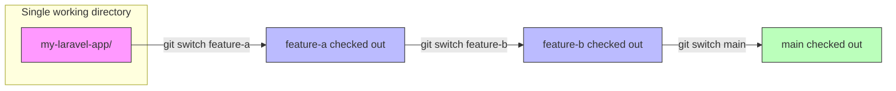
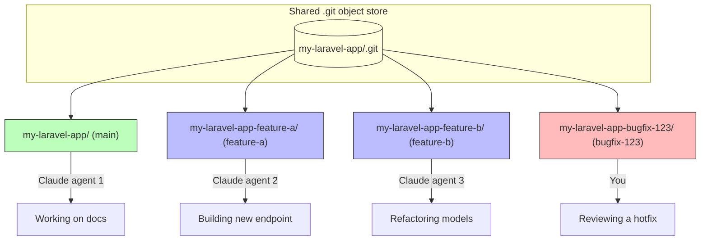

It seems impossible nowadays to go any amount of time without someone mentioning
something about worktrees, especially now in the AI era. None of us are writing code
by hand anymore and it feels shameful to do so (there's a /s in there somewhere). With
every dev now being 1000x and seemingly looking to be replaced by AI in the next six months,
I figured as a last bout of employment in this industry, I would write a bit how I use
worktrees tailored to Laravel development. This isn't a one-size-fits-all solution, nor
is it meant to be.

At work, we use Herd, though as the complexity of your app grows, there can be friction
with Herd. Managing multiple versions of PHP, services attempting to startup and step on
each other's ports, and orphaning linked valet sites can be a real headache at times.
I have a love/slightly annoyed relationship with Herd for this reason. It's mostly self-induced,
though if you're working on a straightforward Laravel app, I'd wager there's really no better
tool for getting up and running quickly with all the things you need to run an actual app
people use (mail, queues, debugging, logging, etc.). You can 100% DIY your own PHP setup
tailored for Laravel, but Herd takes the headache of it away and provides a single focal point
for getting up and running in record time.

This isn't a Herd ad, I promise. With that premise out of the way, I do more worktree-based
development these days as agentic coding tools make it _too_ easy to develop multiple things
in parallel (that doesn't mean they're tested/good, btw). I've really been enjoying [worktrunk](https://worktrunk.dev/) as my worktree manager, and while it's not absolutely necessary for managing worktrees, you'll
quickly find that the built-in worktree tools for git are rough around the edges.

## Worktrees and you

With worktrees, your mental model of development with branches shifts a bit:

- `git switch` and `git checkout` become `cd`
- Branches are folders on local disk
- Every repository has at least one worktree - `main`

Worktrees shine in the world of AI dev because we can throw Claude/Codex at a worktree
and have them work independently of other features/branches without stepping on each other's
toes. A diagram, because who doesn't love mermaid:

### Traditional branching workflow

With a typical branch-based workflow, you have a single working directory and switch between branches. Only one branch is "active" at a time:



You're constantly stashing, switching, and context-swapping. If Claude is mid-generation on `feature-a` and you want to check something on `main`, you're praying nothing else touches your working tree on the way back.

### Worktree workflow

With worktrees, each branch lives in its own directory on disk. They all share a single `.git` object store, so there's no duplication of history:



Every worktree is a fully functional checkout. You can `cd` between them, hit `feature-a.test` and `feature-b.test` side-by-side in the browser, and have multiple agents working simultaneously without conflicts. No stashing, no switching, no waiting.

There's one problem though. Herd links each folder to a `.test` domain, which means every worktree needs
its own link, its own `.env`, and its own database. If I rip a fresh worktree in a Laravel app, just how
in the heck do I get it prepped to be fully functional?

That's where worktrunk comes in.

## Setting up hooks

One of the cool things with worktrunk is the ability to use their worktree hooks to prep a tree with whatever
setup is needed to get a full fledged application environment up and running so you (or your army of agents)
can jump right in and start slinging ~~slop~~ code. For a typical Laravel app, you might:

- Install composer packages
- Install npm packages
- Update `.env` values
- Create databases

And the list goes on. In the world of worktrees, each tree is an isolated checkout with its own dependencies,
database, and services. That means all the supporting dependencies our applications use need to come along
for the ride, and more often than not, need their own isolated running instances as well.

A good example of this is caching. At Givebutter, we run more than a million jobs per day all funneled
through Laravel Horizon. We have a number of queues of varying priority that all serve different purposes
and our local development heavily depends on Horizon to get our work done. Using worktrees and running
multiple instances of our application means we could need multiple Redis instances running for our
independent Horizon runners to pull jobs of the queue and not eat jobs from other running application
instances. In worktrunk speak, this means we could _also_ point our queues to a separate Redis node
that lives separately from the node that `main` works off during local development.

Luckily, worktrunk makes this a breeze through a custom `.config/wt.toml` file that we can tweak to
tell worktrunk what we need setup for our Laravel app to run. Here's an example of the config I use
to run my website:

#### .config/wt.toml

```toml
[post-create]
copy = "wt step copy-ignored"
env = "sed -i '' 's|^APP_URL=.*|APP_URL=https://{{ branch | sanitize }}.test|' {{ worktree_path }}/.env"
database = "touch database/database.sqlite && php artisan migrate:fresh --seed --no-interaction"
storage = "php artisan storage:link --no-interaction"
wayfinder = "php artisan wayfinder:generate --with-form"
build = "npm run build"
herd = "herd link {{ branch | sanitize }} --secure"
```

Heads up for Linux folks: the `sed -i ''` syntax is macOS specific. Drop the empty string argument on Linux.

I use a `.worktreeinclude` file that signals to worktrunk to copy over my vendor dependencies instead of installing them:

#### .worktreeinclude

```
.env
node_modules/
vendor/
```

This saves a bit of time as the project grows, and 99% of the time when I'm ripping new worktrees, a copy of `main`'s
dependencies is what I want. We _could_ also symlink here back to `vendor/` and `node_modules/`, though that'll
allow your worktrees to update your `main` worktree's dependencies and more often than not is NOT what you
want. I keep it simple by copying dependencies over along with my `.env` file.

Worktrunk doesn't care what you name these steps. Pick names that tell you what broke when one of them fails.

Then in my worktrunk `[post-create]` hook, I:

- `sed` replace `APP_URL` with the branch's name to allow Herd to run the site in isolation
- Create a copy of my database, though in the case of non-SQLite, you could swap this out for a `CREATE DATABASE` statement
- Link storage
- Generate types for wayfinder so our frontend can build
- Build frontend assets
- Link the worktree folder to a Herd site

The `wt` CLI is worktrunk's entry point. Now when we run a `wt switch --create feature/foo-bar`, worktrunk does all that work and we have a fully isolated
runtime environment ready for local development that runs entirely independent of `main`. Two versions of the same
app, with Codex/Claude/whatever ready to unleash hell on the code while allowing us to work in silos from our agents.

## Tearing down

We also need the inverse for our worktrees when we're done with our work. We don't want to leave a bunch of orphaned
Herd sites, databases, Redis instances, etc. cluttering up our workspace. Again, worktrunk has us covered with a
`[pre-remove]` hook where we can do exactly that. For example, back in our config, we could add:

#### .config/wt.toml

```toml {}{10-13}
[post-create]
copy = "wt step copy-ignored"
env = "sed -i '' 's|^APP_URL=.*|APP_URL=https://{{ branch | sanitize }}.test|' {{ worktree_path }}/.env"
database = "touch database/database.sqlite && php artisan migrate:fresh --seed --no-interaction"
storage = "php artisan storage:link --no-interaction"
wayfinder = "php artisan wayfinder:generate --with-form"
build = "npm run build"
herd = "herd link {{ branch | sanitize }} --secure"

[pre-remove]
herd-unsecure = "herd unsecure {{ branch | sanitize }}.test --silent || true"
herd-unlink = "herd unlink {{ branch | sanitize }} || true"
database = "rm -f {{ worktree_path }}/database/database.sqlite"
```

The `|| true` on each teardown step keeps a missing site or already-removed link from failing the whole cleanup. Now when we run a `wt remove feat/foo-bar`, worktrunk will handle tearing down our Herd site links and clean up
any provisioned resources (just a SQLite database in this case, though it could also be a `DROP DATABASE` in MySQL or Postgres).

Hooks on both ends are the reason worktrunk earns its keep over raw git worktrees. Your worktrees become reversible environments, not just extra folders on disk.

## Customizing output

As a Herd loyalist, I also find it helpful to know which sites are running associated to my worktrees. Worktrunk has a
neat `wt list` command that'll display a list of all our current worktrees. I like to customize this output to include
the worktree's URL is running under, which in Herd's case, is just the folder path the worktree is located at:

#### .config/wt.toml

```toml {}{14-16}
[post-create]
copy = "wt step copy-ignored"
env = "sed -i '' 's|^APP_URL=.*|APP_URL=https://{{ branch | sanitize }}.test|' {{ worktree_path }}/.env"
database = "touch database/database.sqlite && php artisan migrate:fresh --seed --no-interaction"
storage = "php artisan storage:link --no-interaction"
wayfinder = "php artisan wayfinder:generate --with-form"
build = "npm run build"
herd = "herd link {{ branch | sanitize }} --secure"

[pre-remove]
herd-unsecure = "herd unsecure {{ branch | sanitize }}.test --silent || true"
herd-unlink = "herd unlink {{ branch | sanitize }} || true"
database = "rm -f {{ worktree_path }}/database/database.sqlite"

[list]
url = "https://website.testhttps://{{ branch | sanitize }}.test"
```

Worktrunk supports jinja-style templating, so it's a nice way to tweak output based on injected variables any time
you run a worktrunk command. Now when I `wt list`, I get a nice list of worktrees and the Herd URLs they're running at.

## LLM commits

Now for worktrunk's pièce de résistance (imo), LLM generated commits.

This can be a controversial take. Some folks prefer to write their own commit messages, some couldn't care less
exactly _who_ writes them. The problem I see more often than not is that the number of devs that simply write
absolute garbage within a commit message is non-zero. And don't kid yourself, you've probably committed a
`wip` or two (or three) with no commit descriptions.

And commit descriptions? Forget it, ain't no one got time for that. The caveat here is that I've worked
with developers that really put a lot of time and thought into commit descriptions, only for no one to
read them. Commit descriptions are great, especially when given some tender loving care with thoughtful
content that answers questions that may arise within a pull request before they're ever asked.

But LLMs do it better.

Worktrunk has a `wt step commit` that'll summarize changes and use your favorite LLM to write a commit.
The amount of time I've saved with that command alone is immeasurable at this point. Does anyone
still read the commit descriptions? Of course not, but they're there if anyone wants to and concise enough
to capture the intent of the changes within a commit.

We can configure LLM generated commits with worktrunk fairly easily within a global `config.toml` file that lives
wherever you put your config. I'm a bit obsessive over my dotfiles, so everything lives at `~/.config` for all
the tooling configuration I use, where a `~/.config/worktrunk/config.toml` acts as a global configuration file
that merges with my local repository's `wt.toml` file.

Here's my global `config.toml` where I put commit instructions and tell worktrunk to have Claude co-author commits,
because if I'm vibe coding, I at least want it to be very apparent that Claude is my co-pilot:

#### ~/.config/worktrunk/config.toml

```toml
[commit.generation]
command = "CLAUDECODE= MAX_THINKING_TOKENS=0 claude -p --model=haiku --tools='' --disable-slash-commands --setting-sources='' --system-prompt=''"

template = """
Write a commit message for the staged changes below.

<format>
- Commit message MUST have a co-author trailer of "Co-Authored-By: Claude Haiku 4.6 <noreply@anthropic.com>"
- Subject line MUST use a conventional commit prefix: feat, fix, refactor, chore, docs, test, style, perf, ci, build
- Subject line format: `type(scope): description` or `type: description`
- Subject line under 50 chars, lowercase, no period
- Add a blank line then a body paragraph describing what changed and why
- Body lines wrap at 72 chars
- Output only the commit message, no quotes or code blocks
</format>

<style>
- Imperative mood: "add feature" not "added feature"
- Scope is optional but encouraged when the change is localized (e.g. auth, api, ui)
- The body should explain context a reviewer would find useful, not just restate the diff
</style>

<diffstat>
{{ git_diff_stat }}
</diffstat>

<diff>
{{ git_diff }}
</diff>

<context>
Branch: {{ branch }}
<recent_commits>
- {{ commit }}
</recent_commits>
</context>
"""
```

The flags on the `claude` command (`--tools=''`, `--disable-slash-commands`, `--setting-sources=''`, `--system-prompt=''`) strip the run down to just the prompt for a fast, deterministic execution with no tool calls or slash command resolution.

Worktrunk exposes `{{ git_diff }}`, `{{ git_diff_stat }}`, `{{ recent_commits }}`, and `{{ branch }}` (plus `{{ target_branch }}` and `{{ commits }}` for squash templates) so you can shape the prompt however your brain wants it.

Using the template variables worktrunk provides, it's almost too easy to customize a commit prompt to your liking.
I keep mine fairly simple, trying not to overcomplicate nor overengineer a commit message. After all, I want people
to actually _read_ the messages and descriptions and feel like it's not AI slop (still happens from time to time).

Another cool thing is squash templates. On a worktree, I might have 10 or so commits in a feature and when doing a `wt merge`,
I don't really care to see all of those commits in a linear fashion. I'm team squash-merge, simply because I want to look
at a single feature branch commit merged to the trunk branch that captures the intent of the feature within the message.

As you might have guessed, worktrunk has that covered as well with `squash-template`s in our global `config.toml` file:

#### ~/.config/worktrunk/config.toml

```toml {}{39-62}
[commit.generation]
command = "CLAUDECODE= MAX_THINKING_TOKENS=0 claude -p --model=haiku --tools='' --disable-slash-commands --setting-sources='' --system-prompt=''"

template = """
Write a commit message for the staged changes below.

<format>
- Commit message MUST have a co-author trailer of "Co-Authored-By: Claude Haiku 4.6 <noreply@anthropic.com>"
- Subject line MUST use a conventional commit prefix: feat, fix, refactor, chore, docs, test, style, perf, ci, build
- Subject line format: `type(scope): description` or `type: description`
- Subject line under 50 chars, lowercase, no period
- Add a blank line then a body paragraph describing what changed and why
- Body lines wrap at 72 chars
- Output only the commit message, no quotes or code blocks
</format>

<style>
- Imperative mood: "add feature" not "added feature"
- Scope is optional but encouraged when the change is localized (e.g. auth, api, ui)
- The body should explain context a reviewer would find useful, not just restate the diff
</style>

<diffstat>
{{ git_diff_stat }}
</diffstat>

<diff>
{{ git_diff }}
</diff>

<context>
Branch: {{ branch }}
<recent_commits>
- {{ commit }}
</recent_commits>
</context>
"""

squash-template = """
Combine these commits into a single commit message.

<format>
- Commit message MUST have a co-author trailer of "Co-Authored-By: Claude Haiku 4.6 <noreply@anthropic.com>"
- Subject line MUST use a conventional commit prefix: feat, fix, refactor, chore, docs, test, style, perf, ci, build
- Subject line format: `type(scope): description` or `type: description`
- Subject line under 50 chars, lowercase, no period
- Add a blank line then a body paragraph summarizing the overall change and why it was made
- Body lines wrap at 72 chars
- Output only the commit message, no quotes or code blocks
</format>

<commits branch="{{ branch }}" target="{{ target_branch }}">
- {{ commit }}
</commits>

<diffstat>
{{ git_diff_stat }}
</diffstat>

<diff>
{{ git_diff }}
</diff>
"""
```

It's basically just some copy-pasta of the commit template, the only difference being a loop that rolls through each commit
and provides the messages to Claude to sensibly summarize into a single squash-merge commit.

## Honorable mentions

By now, you're probably wondering what else is out there. And you're in luck, as Claude has [official support](https://code.claude.com/docs/en/settings#worktree-settings) for worktrees in Claude Code, and tools like [Conductor](https://www.conductor.build/) make
it easy for the GUI enjoyers to manage worktrees in a nice UI. There's also [cmux](https://cmux.com/) which builds
on top of ghostty (the Lord's terminal emulator) that sits somewhere in between a tool like worktrunk and Conductor.
I live in the terminal and have a general disdain for GUIs, so worktrunk fits my needs exactly. There's no lack of
AI-guided tooling assistants, so I encourage you to find one that you like and give it a go.

## And so, so much more

I've been using worktrees with worktrunk for all of my Laravel projects over the past year and have found them to be a true boost
to productivity. I find them extremely helpful when working on a feature and having to pivot to other issues, where I would
have stashed/committed changes, switched to main, ripped bug fix branches, etc. Worktrees are like a bookmark in your code novel,
allowing you to maintain your place while re-reading previous chapters that you might want to take another look at (I don't think
that analogy works, but it's all I got). In the age of AI writing all our code, I'll take any tool I can get that helps make sense
of all the slop that comes through the pipeline.

Well, I think I've rambled on long enough. Until next time, friends!
